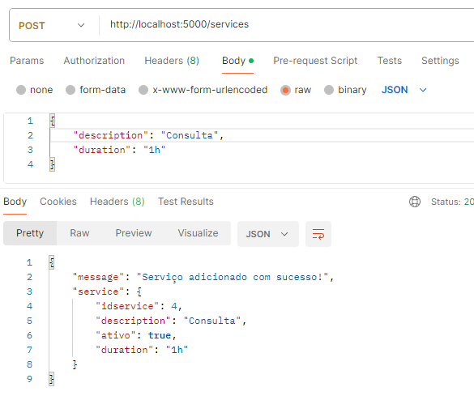
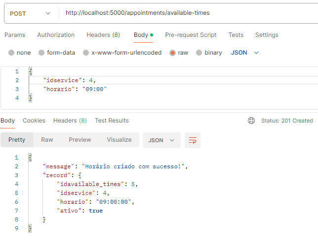

# Sistema de Agendamento com Notificação

## 🚀 Começando

Essas instruções permitirão que você obtenha uma cópia do projeto em operação na sua máquina local para fins de desenvolvimento e teste.

### 📋 Pré-requisitos

Rode os comandos na pasta frontend e na backend

```
npm install
```

Crie um .env e coloque as informações do banco desejado.

```
PG_HOST=-
PG_PORT=-
PG_DATABASE=-
PG_USER=-
PG_PASSWORD=-
```

Ainda no seu .env, defina a chave secreta do JWT, um email e uma senha (serão usados para emissão de notificações)

```
JWT_SECRET=sua chave
EMAIL_USER=seu email
EMAIL_PASS=sua senha
```

O arquivo com o script do banco de dados se encontra em:

```
backend/db/script.sql
```

## ⚙️ Executando
Nas duas pastas (frontend e backend), rode:

```
npm run dev
```


## 📦 Implantação

Para popular:

1- Aponte para rota "services" e passe os parâmetros "description" (string) e "duration" (string).
   Guarde o "idservice" que será retornado.


   

   
2- Com o "idservice" em mãos, use para cadastrar horários apontando para rota "appointments/available-times", 
   passando os parâmetros "idservice" (integer) e "horario" (time - ex: 09:00).
   

## 🛠️ Construído com

* [REACTJS] - FRONT-END
* [NODEJS] - BACK-END
* [POSTGRESQL] - BANCO DE DADOS
